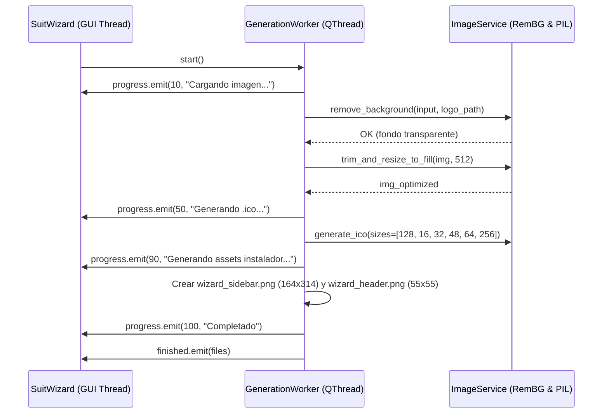

# 03_01: Bucle Principal y Core Loop - ABL Suit Favicon

## 🔄 Flujo del Pipeline en `GenerationWorker`

```mermaid
sequenceDiagram
    participant UI as SuitWizard (GUI Thread)
    participant Worker as GenerationWorker (QThread)
    participant ImageSvc as ImageService (RemBG & PIL)
    
    UI->>Worker: start()
    Worker->>UI: progress.emit(10, "Cargando imagen...")
    Worker->>ImageSvc: remove_background(input, logo_path)
    ImageSvc-->>Worker: OK (fondo transparente)
    Worker->>ImageSvc: trim_and_resize_to_fill(img, 512)
    ImageSvc-->>Worker: img_optimized
    Worker->>UI: progress.emit(50, "Generando .ico...")
    Worker->>ImageSvc: generate_ico(sizes=[128, 16, 32, 48, 64, 256])
    Worker->>UI: progress.emit(90, "Generando assets instalador...")
    Worker->>Worker: Crear wizard_sidebar.png (164x314) y wizard_header.png (55x55)
    Worker->>UI: progress.emit(100, "Completado")
    Worker->>UI: finished.emit(files)
```
